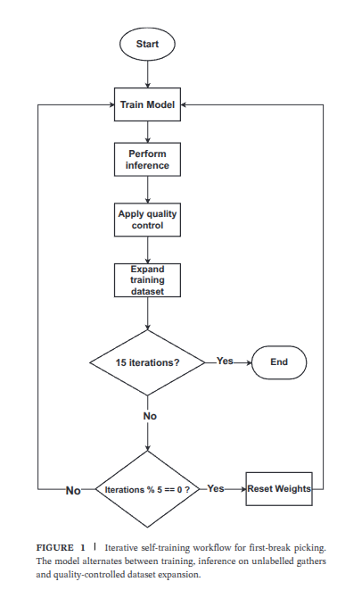

# First-Break Picking: Self-Training U-Net with Minimal Annotations

**Source:** Meneses, A., Araújo, R. C. F., Corso, G., de Araújo, J. M., Barros, T. (2026).
*A Self-Training U-Net Approach for First-Break Picking With Minimal Annotations.*
Geophysical Prospecting, 74: e70325. https://doi.org/10.1111/1365-2478.70325

**Data:** Hardpicks benchmark (St-Charles et al., 2023) — `github.com/mila-iqia/hardpicks`

---

## 1. Task formulation

- First-break picking is cast as **binary semantic segmentation**: every pixel
  (time sample × trace) of a full shot gather is classified as `first break` vs `background`.
- **Site-specific training**: one model per survey site, adapted using only ~1% manually
  labelled gathers — no cross-site transfer.
- **Pick extraction (post-processing):** from the pre-softmax first-break logit map
  $z_b(t, i)$, take per trace $i$ the time of the maximum first-break logit:
  $$\hat{y}_i = \arg\max_t \, z_b(t, i)$$
- If the background logit wins everywhere on a trace, that trace is left **unpicked**
  (this is measured by the coverage metric).

## 2. Data

### 2.1 Datasets (land reflection surveys; explosive sources; parallel geophone lines)

| Dataset   | Total gathers | Valid gathers | Sampling rate |
|-----------|--------------:|--------------:|:-------------:|
| Brunswick | 18,475        | 18,442        | 2 ms          |
| Halfmile  | 5,520         | 5,491         | 2 ms          |
| Lalor     | 14,455        | 12,020        | **1 ms**      |
| Sudbury   | 11,420        | 4,306         | 2 ms          |

*Valid = excludes low-quality records and gathers with < 1% annotated traces.*

### 2.2 Splits

- **1% of gathers** (random) form the labelled pool, split **75% train / 25% validation**.
- The remaining **99%** is the test set and the source pool for pseudo-labelling.
- Initial labelled set sizes: Brunswick 148, Halfmile 54, Lalor 120, Sudbury 43.
- **10 random seeds** → 10 independent splits/runs per configuration; report mean ± std.

### 2.3 Preprocessing

1. **Padding:** pad all gathers to the largest gather size in the training set; pad value = **1**.
2. **Per-trace z-score normalization** (subtract mean, divide by std) — compensates
   geometric spreading / amplitude decay with offset.
3. **16-bit binning** of normalized amplitudes (light smoothing; input still float).
4. **No data augmentation** (no cropping, amplitude changes, dead-trace insertion,
   polarity inversion) — found unnecessary.

## 3. Model: U-Net

- 4 encoder / 4 decoder blocks with skip connections (Ronneberger et al., 2015);
  input = full gather ($N_t \times N_r$).
- **Encoder block:** `2 × [conv 3×3 (stride 1) → BatchNorm → LeakyReLU(slope=0.01)]`,
  then `maxpool 2×2 (stride 2)`. Channels: 64 → 128 → 256 → 512.
- **Bottleneck:** double conv block at lowest resolution.
- **Decoder block:** `transposed conv 2×2` upsample → concat skip connection →
  `2 × [conv 3×3 → BatchNorm → LeakyReLU]`.
- **Head:** `conv 1×1` → 2-channel logit map (first break / background), same spatial
  size as input; pixel class = channel argmax.

## 4. Labels & loss (two key ingredients)

### 4.1 Problem: extreme class imbalance

Exactly **1 positive sample per trace** vs hundreds–thousands of background samples;
naive training collapses to all-background predictions.

| Dataset   | Annotation coverage | Imbalance (point) | Imbalance (±5 window) | Reduction |
|-----------|--------------------:|------------------:|----------------------:|:---------:|
| Brunswick | 83.10%              | 1:902.7           | 1:81.2                | 11.1×     |
| Halfmile  | 90.77%              | 1:826.4           | 1:74.2                | 11.1×     |
| Lalor     | 55.28%              | 1:2714.2          | 1:245.8               | 11.0×     |
| Sudbury   | 28.22%              | 1:3546.7          | 1:321.5               | 11.0×     |

### 4.2 Windowed labelling

- Dilate each point annotation **±5 samples → 11-sample positive window**.
- At 2 ms sampling this is **±10 ms** — within acceptable timing tolerance for
  downstream processing (static corrections).
- Reduces class imbalance ~11×; keeps the two-class formulation simple.

### 4.3 Weighted binary cross-entropy

$$\mathcal{L} = -\frac{1}{M}\sum_{i=1}^{M} w_i\left[\,y_i \log \hat{y}_i + (1-y_i)\log(1-\hat{y}_i)\,\right]$$

- $M$ = pixels in batch; $y_i \in \{0,1\}$ ground truth; $\hat{y}_i$ prediction; $w_i$ sample weight.
- **$w_i = 100$ for first-break samples, $w_i = 1$ for background** — missed picks are
  penalized 100× more than false positives (misses are costlier than spurious picks).

## 5. Iterative self-training with quality control

### 5.1 Loop (paper Fig. 1)

for iteration in 1..15:
train model for 5 epochs (Adam, lr=1e-3) # warm-started
run inference on 200 unlabelled gathers
apply quality control (5.2)
add QC-passing gathers (with pseudo-labels) to the training set
if iteration % 5 == 0 and iteration < 15:
reset model weights # → three 25-epoch cycles

- Total: **15 iterations × 5 epochs = 75 epochs**; weight resets after iterations 5 and 10
  give **three successive 25-epoch cycles** on an ever-growing dataset.
  Pseudo-labelled data are **kept** across resets (only the optimization restarts).
- **200 gathers/iteration**: balances training-set growth vs. the risk of admitting a
  large block of correlated pseudo-labels before re-validation.
- Pseudo-labels receive the same ±5-sample window dilation (implied by the config).

### 5.2 Quality control (adapted from Loginov et al., 2022)

Per candidate gather:
1. Divide the **offset range into 20 equal-width bins** (first-break times vary
   smoothly with offset within a gather).
2. Per bin, compute mean and std of predicted first-break times.
3. **Trace level:** discard picks deviating > **2σ** from their bin mean.
4. **Gather level:** accept the gather only if **≥ 85% of its picks survive**
   (≤ 15% traces rejected); otherwise reject the whole gather.

### 5.3 Resulting training-set growth (means over 10 runs)

| Dataset   | Added / iteration | Final train size | % of dataset used |
|-----------|------------------:|-----------------:|------------------:|
| Brunswick | 199.86 ± 0.15     | 2,546.2 ± 1.9    | 13.81%            |
| Halfmile  | 199.99 ± 0.03     | 2,443.8 ± 0.4    | 44.51%            |
| Lalor     | 199.97 ± 0.05     | 2,495.8 ± 0.4    | 20.76%            |
| Sudbury   | 199.50 ± 0.58     | 2,428.7 ± 7.1    | 56.40%            |

## 6. Ablation configurations

| # | Name          | Windowed labels | Weighted loss | Iterative expansion |
|---|---------------|:---:|:---:|:---:|
| 1 | Control       | – | – | – |
| 2 | Windowed      | ✓ | – | – |
| 3 | Weighted loss | – | ✓ | – |
| 4 | Combined      | ✓ | ✓ | – |
| 5 | Iterative     | ✓ | ✓ | ✓ |

- Optimizer: **Adam, lr = 1×10⁻³**; configs 1–4: **25 epochs**; config 5 as in §5.1.
- Compute (A100): static ≈ 1.3–5.3 min/run; iterative ≈ 109–165 min/run
  (~25–100× more, scaling with dataset growth); inference + QC adds ~6–7 min.

## 7. Evaluation protocol

- Metrics computed on all gathers **except the initial labelled training set**;
  pseudo-labelled gathers are evaluated against the **original manual picks**
  (never against the model's own labels).
- **Coverage:** $C = N_{pred}/N_{total}$ — fraction of annotated traces with a prediction.
- **Total accuracy** (missing predictions count as errors):
  $$W_{total}(x) = \frac{1}{N_{total}}\sum_{t=1}^{N_{total}} \mathbb{1}_{\,|y_t - \hat{y}_t| \le x}$$
- **Prediction accuracy** (only traces with a prediction, set $P$):
  $$W_{pred}(x) = \frac{1}{N_{pred}}\sum_{t \in P} \mathbb{1}_{\,|y_t - \hat{y}_t| \le x}$$
- Identity: $W_{total}(x) = C \cdot W_{pred}(x)$.
- **MAE** (predicted traces only):
  $$MAE = \frac{1}{N_{pred}}\sum_{t \in P} |y_t - \hat{y}_t|$$
- Tolerances $x \in \{0, 2, 5, 10\}$ samples; **$W_{total}(10)$** (±10 samples ≈ ±20 ms
  at 2 ms) is the headline end-to-end metric.

## 8. Key results (mean ± std, 10 runs)

**Coverage (%):**

| Method        | Brunswick     | Halfmile      | Lalor         | Sudbury      |
|---------------|---------------|---------------|---------------|--------------|
| Control       | 71.14 ± 8.70  | 76.90 ± 9.21  | 53.15 ± 12.48 | 0.01 ± 0.02  |
| Weighted loss | 96.57 ± 0.82  | 89.10 ± 14.93 | 95.90 ± 2.70  | 81.76 ± 11.04|
| Windowed      | 93.01 ± 2.84  | 91.35 ± 7.37  | 86.52 ± 5.11  | 71.56 ± 13.81|
| Combined      | 97.79 ± 0.78  | 97.70 ± 2.06  | 98.80 ± 0.76  | 91.81 ± 4.21 |
| **Iterative** | **99.05 ± 0.43** | **99.68 ± 0.20** | **99.95 ± 0.02** | **98.94 ± 0.37** |

**Iterative model:** $W_{total}(10)$ = 0.984 / 0.989 / 0.981 / 0.970;
$W_{pred}(10) \approx 0.98$–0.99; MAE = 2.50 / 2.68 / 2.92 / 6.04 samples
(Brunswick / Halfmile / Lalor / Sudbury).

**Vs. cross-site benchmark (St-Charles et al., 2023):** comparable on 3 of 4 sites;
decisively better where acquisition differs (Lalor, 1 ms sampling): MAE 2.92 vs 124
samples (−97.6%), with ~**2 orders of magnitude less manual annotation** (1% of
gathers vs ~72% of traces, 2 complete sites).

| Aspect                  | St-Charles et al.  | This work            |
|-------------------------|--------------------|----------------------|
| Training data source    | 2 complete sites   | 1% of target site    |
| Transfer requirement    | Cross-site         | None                 |
| Adaptation to new site  | Direct application | Minimal retraining   |

## 9. Pipeline design checklist

1. [ ] Ingest full shot gathers; pad-to-max (value 1); per-trace z-score; 16-bit quantize.
2. [ ] Dilate picks to ±5 samples (rescale to keep ~±10 ms at other sampling rates).
3. [ ] WBCE loss, positive weight 100.
4. [ ] U-Net, 4 scales (64→512), BN + LeakyReLU(0.01), 1×1 2-logit head;
       pick = per-trace argmax of first-break logit.
5. [ ] Initial fit on ~1% labelled gathers (75/25 train/val), Adam, lr 1e-3.
6. [ ] Self-training: 15 × [5 epochs → infer 200 unlabelled → offset-bin(20) 2σ QC →
       keep gathers with ≥85% picks retained → expand]; reset weights every 5 iterations.
7. [ ] Evaluate with coverage / $W_{total}$ / $W_{pred}$ / MAE vs manual picks; ≥10 seeds.

## 10. Limitations / open knobs (per the authors)

- QC thresholds (20 bins, 2σ, 85%) are fixed heuristics → adaptive, data-driven
  thresholding suggested.
- Fixed 200 gathers/iteration → could be scheduled by model confidence.
- Windowed labels trade away sample-exact accuracy ($W(0)$ is low); add a refinement
  stage if exact picks are required.
- U-Net kept for comparability; transformers/graph nets suggested for long-range
  spatial coherence.